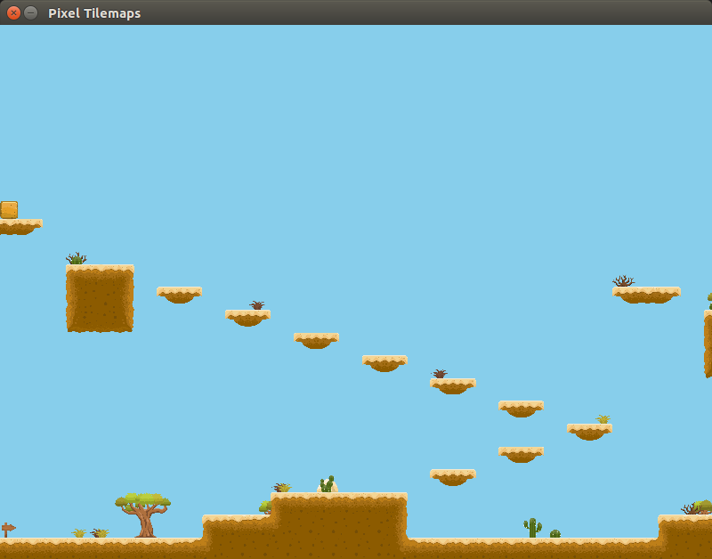

# Pixel Tiles Example
This is a very--VERY--simple example of how you might load a tilemap generated with [Tiled](https://www.mapeditor.org/) (i.e. a .tmx file), 
in a game with [Pixel](https://github.com/faiface/pixel) for Go.

The tilemap used in this example is humbly borrowed from James Bowman's repo here: [https://github.com/jamesbowman/tiled-maps](https://github.com/jamesbowman/tiled-maps).

> Note: the hard-coded `tiles` array could easily be automated into something like loading from a data file--just store the coordinate of the tile in the tile map, along with the position you want to draw it at in your game coordinates.

## Preview

## Tilemap
